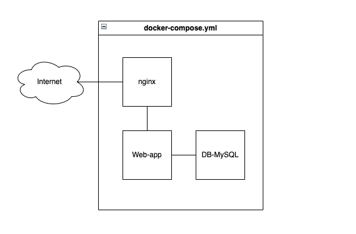

# Home task

# Basic flow:

When a POST request (including the username) is made to the ״/״ endpoint, it establishes a connection to the MySQL database.

It tries to fetch the user with the given username.

If no such user exists, it fetches all users and returns them in the response.

If the user does exist, it deletes the user from the database and writes the user data to a JSON file in the archive folder.

Finally, it closes the database connection.

# Additional notes:

Secrets are saved in .env and parsed to the containers accordingly.

Nginx acts as a reversed proxy in the setup. 

Only the neccessary ports are opened.
